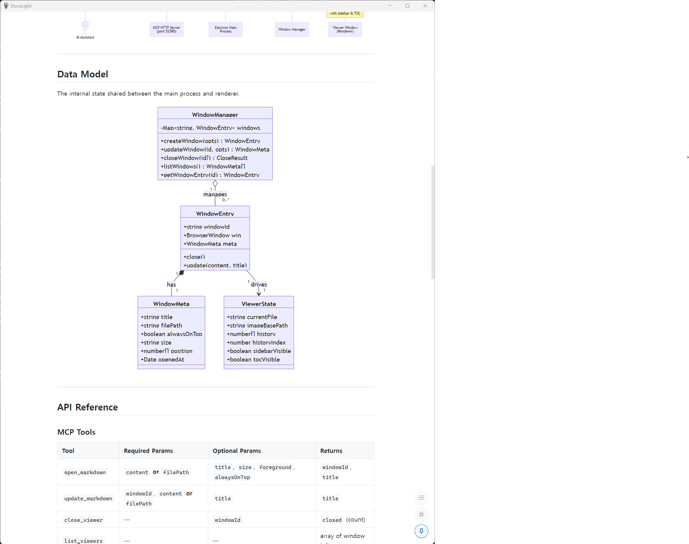

<div align="center">


# DocuLight

**Lightweight Markdown Viewer for Developers & AI Agents**

[](https://github.com/ice3x2/DocuLightViewer/releases)
[](LICENSE)
[](#installation)
[](#mcp-integration)

A desktop Markdown viewer built on Electron.
Renders GitHub-flavored Markdown, Mermaid diagrams, and syntax-highlighted code blocks.
Supports MCP (Model Context Protocol) so AI coding agents can open and update documents remotely.

</div>

---

## The Core Use Case — AI Agents Reporting to You

When a background coding agent finishes its work, it shouldn't just print a wall of text to
a terminal you might not be watching.
With DocuLight running in the background, the agent calls `open_markdown` with
`foreground: true` and **the report window jumps to the front of your screen** the moment the
job is done — no polling, no missed notifications.

```
╔══════════════════════════════════════════════════════════╗
║  Background Agent (Claude Code / any MCP client)         ║
║                                                          ║
║  1. Runs tasks autonomously …                            ║
║  2. Builds a Markdown report                             ║
║  3. Calls open_markdown(content, foreground: true)  ───► ║ DocuLight window
║                                                          ║   pops to foreground
╚══════════════════════════════════════════════════════════╝   immediately ✔
```

```javascript
// Agent reports completion — user sees it instantly
await mcpClient.callTool('open_markdown', {
  content: `# ✅ Task Complete\n\n${summary}\n\n## Changed Files\n${fileList}`,
  title:   'Agent Report',
  foreground:  true,   // ← brings window to front
  alwaysOnTop: true,   // ← stays visible while you read
  size: 'l'
});
```

The window stays **always-on-top** so it remains visible while you switch to your editor,
and a sidebar navigation tree lets you jump around a long report instantly.

---

## Screenshot



*DocuLight rendering a class diagram, sequence diagram, and API reference table — with sidebar
and Table of Contents visible.*

---

## Features

### Markdown Rendering
- **GitHub-Flavored Markdown (GFM)** — tables, task lists, strikethrough, autolinks
- **Mermaid Diagrams** — flowcharts, sequence, class, ER, Gantt, pie, xychart, and more
- **Syntax Highlighting** — 190+ languages via [highlight.js](#supported-languages)
- **Inline Images** — local files rendered via secure data-URI IPC (works in Electron sandbox)

### Navigation & UI
- **Sidebar link tree** — auto-generated from Markdown links (`[text](url)` and `[[wikilinks]]`)
- **Table of Contents** — auto-generated from headings, always visible on the right
- **Tabs** — open multiple documents in one window (`Ctrl+T`)
- **Navigation history** — back / forward buttons and keyboard shortcuts
- **Find in page** — `Ctrl+F`
- **Sidebar file search** — fuzzy-filter sidebar links (`Ctrl+Shift+F`)
- **Zoom** — `Ctrl+=` / `Ctrl+-` / `Ctrl+0`

### Window Management
- **Multiple viewer windows** — cascaded positions, each fully independent
- **Window size presets** — `s` / `m` / `l` / `f` (full-screen)
- **Always-on-top pin** — keep a report visible while coding
- **Foreground mode** — `open_markdown` can steal focus to alert you immediately
- **System tray** — app stays alive when all windows are closed; agents can open new ones at any time
- **Named windows** — `windowName` key for upsert (reuses an existing window instead of opening a new one)
- **Window tags** — `tags` array for grouping; close or list windows by tag
- **Severity color bar** — 4 px accent bar at the window top (`info` / `success` / `warning` / `error`)
- **Auto-close timer** — `autoCloseSeconds` closes the window after N seconds with a countdown UI
- **Taskbar progress bar** — `progress` (0.0 – 1.0) shows task completion on the OS taskbar; `-1` hides it
- **Taskbar flash** — `flash: true` blinks the taskbar button to request user attention

### Developer Workflow
- **MCP server (HTTP)** — embedded in the Electron process, reachable at `http://localhost:52580/mcp`
- **MCP server (stdio)** — standalone `mcp-server.mjs` for Claude Desktop and other stdio clients
- **Port discovery file** — actual bound port written to `{userData}/mcp-port` at startup
- **Auto-refresh** — watches the file on disk; reloads automatically on save
- **PDF export** — render the current document as a PDF
- **File association** — register `.md` files to open with DocuLight (packaged builds)
- **Settings UI** — theme, font size, font family, code theme, MCP port, auto-refresh, tabs
- **MCP auto-save** — MCP-opened files are auto-saved to a configurable path in date-based subdirectories

### Themes & Appearance
| Option | Choices |
|--------|---------|
| UI Theme | `light`, `dark` |
| Code Highlight | `github`, `github-dark`, `monokai`, `dracula` |
| Font Size | 8–32 px (default 16) |
| Font Family | Any CSS font stack |

---

## MCP Integration

DocuLight exposes **four MCP tools** over both HTTP and stdio transports.

### Tools

| Tool | Description |
|------|-------------|
| `open_markdown` | Open a new viewer window from raw Markdown or a file path |
| `update_markdown` | Update the content / title of an existing window |
| `close_viewer` | Close one specific window or all windows |
| `list_viewers` | List all open viewer windows with their IDs and titles |

### `open_markdown` parameters

| Parameter | Type | Default | Description |
|-----------|------|---------|-------------|
| `content` | string | — | Raw Markdown string to display |
| `filePath` | string | — | Absolute path to a `.md` file |
| `title` | string | filename | Window title bar text |
| `size` | `s`/`m`/`l`/`f` | `m` | Window size preset |
| `foreground` | boolean | `true` | Bring window to front immediately |
| `alwaysOnTop` | boolean | `true` | Keep window above all other windows *(HTTP MCP only)* |
| `windowName` | string | — | Named key for upsert — reuses existing window if name matches |
| `severity` | `info`/`success`/`warning`/`error` | — | Color bar theme at window top |
| `tags` | string[] | — | Tags for grouping / filtering windows |
| `flash` | boolean | `false` | Flash taskbar button to request user attention |
| `progress` | number (-1 – 1.0) | — | Taskbar progress bar value (`-1` = hide) |
| `autoCloseSeconds` | integer (1 – 3600) | — | Auto-close window after N seconds |
| `noSave` | boolean | `false` | Skip auto-save for this call even if MCP auto-save is enabled |

### `update_markdown` parameters

| Parameter | Type | Default | Description |
|-----------|------|---------|-------------|
| `windowId` | string | **required** | Target window ID |
| `content` | string | — | New Markdown content |
| `filePath` | string | — | New file path to display |
| `title` | string | — | New window title |
| `appendMode` | boolean | `false` | Append to existing content instead of replacing |
| `separator` | string | `\n\n` | Separator used between existing and new content in append mode |
| `severity` | string | — | Update color bar theme (empty string to clear) |
| `tags` | string[] | — | Replace window tags |
| `flash` | boolean | `false` | Flash taskbar button |
| `progress` | number (-1 – 1.0) | — | Update taskbar progress bar |
| `autoCloseSeconds` | integer (1 – 3600) | — | Reset or set auto-close timer |
| `noSave` | boolean | `false` | Skip auto-save for this call even if MCP auto-save is enabled |

### `close_viewer` parameters

| Parameter | Type | Description |
|-----------|------|-------------|
| `windowId` | string *(optional)* | Close a specific window by ID |
| `tag` | string *(optional)* | Close all windows that have this tag |

If neither `windowId` nor `tag` is provided, all open viewer windows are closed.

### `list_viewers` parameters

| Parameter | Type | Description |
|-----------|------|-------------|
| `tag` | string *(optional)* | Filter results — return only windows with this tag |

### Code examples

```javascript
// Open a named window and show a progress bar — no duplicate windows on repeated calls
await mcpClient.callTool('open_markdown', {
  windowName: 'build-status',
  title: '🔨 Build in Progress',
  content: '# Building…\nStarting compilation.',
  severity: 'info',
  progress: 0.0,
});

// Update the same named window with append mode as the build progresses
await mcpClient.callTool('update_markdown', {
  windowId: buildWindowId,
  appendMode: true,
  content: '✅ Compilation done. Running tests…',
  progress: 0.5,
});

// On completion: update severity, remove progress bar, auto-close after 30 s
await mcpClient.callTool('update_markdown', {
  windowId: buildWindowId,
  severity: 'success',
  title: '✅ Build Passed',
  progress: -1,
  flash: true,
  autoCloseSeconds: 30,
});
```

### Configure with Claude Code

```bash
# Register the HTTP MCP server (one-time setup)
claude mcp add --transport http doclight http://localhost:52580/mcp
```

### Configure with Claude Desktop

Add to `~/Library/Application Support/Claude/claude_desktop_config.json` (macOS) or
`%APPDATA%\Claude\claude_desktop_config.json` (Windows):

```json
{
  "mcpServers": {
    "doculight": {
      "command": "node",
      "args": ["C:/path/to/DocuLightViewer/src/main/mcp-server.mjs"]
    }
  }
}
```

### Quick test via curl

```bash
curl -X POST http://localhost:52580/mcp \
  -H "Content-Type: application/json" \
  -d '{
    "jsonrpc": "2.0", "id": 1,
    "method": "tools/call",
    "params": {
      "name": "open_markdown",
      "arguments": {
        "content": "# Hello from the terminal!\n\nThis window was opened by **curl**.",
        "title": "curl demo",
        "foreground": true
      }
    }
  }'
```

---

## Installation

Download the latest installer from the
[**Releases**](https://github.com/ice3x2/DocuLightViewer/releases) page.

| Platform | File |
|----------|------|
| Windows (Installer) | `DocuLight-Setup-x.x.x.exe` |
| Windows (Portable) | `DocuLight-Portable-x.x.x.exe` |
| macOS (Apple Silicon) | `DocuLight-x.x.x-arm64.dmg` |
| macOS (Intel) | `DocuLight-x.x.x-x64.dmg` |
| Linux (AppImage) | `DocuLight-x.x.x.AppImage` |
| Linux (Debian/Ubuntu) | `DocuLight-x.x.x.deb` |

### Run from source

```bash
git clone https://github.com/ice3x2/DocuLightViewer.git
cd DocuLightViewer
npm install
npm start          # launch app
npm run dev        # launch with --dev flag
```

**Requirements**: Node.js ≥ 20, npm

---

## Keyboard Shortcuts

| Shortcut | Action |
|----------|--------|
| `Ctrl+T` | Open new tab via file dialog |
| `Ctrl+W` | Close current tab / window |
| `Ctrl+B` | Toggle sidebar |
| `Ctrl+Shift+F` | Toggle sidebar file search |
| `Ctrl+F` | Find in page |
| `Ctrl+=` / `Ctrl+-` / `Ctrl+0` | Zoom in / out / reset |
| `Alt+←` / `Alt+→` | Navigate back / forward |
| `Escape` | Close PDF modal → exit sidebar search → release always-on-top |

---

## Supported Languages

Syntax highlighting is powered by [highlight.js](https://highlightjs.org/) and covers
**190+ languages**, including:

`bash` `c` `c++` `c#` `clojure` `coffeescript` `css` `dart` `diff` `dockerfile`
`elixir` `elm` `erlang` `fortran` `go` `graphql` `groovy` `haskell` `html` `http`
`java` `javascript` `json` `json5` `julia` `kotlin` `latex` `less` `lisp` `lua`
`makefile` `markdown` `matlab` `nginx` `nix` `objective-c` `ocaml` `perl` `php`
`plaintext` `powershell` `protobuf` `python` `r` `ruby` `rust` `scala` `scss`
`shell` `sql` `swift` `toml` `typescript` `vb` `vbscript` `vim` `wasm` `xml`
`yaml` `zig` … and [many more](https://highlightjs.org/demo).

### Mermaid Diagram Types

`flowchart` `sequenceDiagram` `classDiagram` `erDiagram` `gantt` `pie`
`stateDiagram-v2` `journey` `gitGraph` `mindmap` `timeline` `xychart-beta`
`quadrantChart` `sankey-beta` `block-beta`

---

## Architecture

```
DocuLight
├── src/main/
│   ├── index.js           Electron main process, IPC hub, app lifecycle
│   ├── window-manager.js  BrowserWindow lifecycle, cascade positions, history
│   ├── link-parser.js     Directory scanner → sidebar file tree (.md files)
│   ├── preload.js         contextBridge API (window.doclight)
│   ├── mcp-server.mjs     MCP stdio server (for Claude Desktop)
│   └── mcp-http.mjs       MCP HTTP server embedded in Electron (port 52580)
└── src/renderer/
    ├── viewer.html/js/css  Markdown viewer page
    ├── settings.html/js    Settings UI
    ├── tab-manager.js      Tab-based multi-document view
    ├── sidebar-search.js   Sidebar fuzzy search/filter
    ├── pdf-export-ui.js    PDF export modal
    └── image-resolver.js   Relative image path → file:// URL
```

---

## License

ISC © [ice3x2](https://github.com/ice3x2)

---

<div align="center">

Made with [Electron](https://www.electronjs.org/) ·
[Marked](https://marked.js.org/) ·
[Mermaid](https://mermaid.js.org/) ·
[highlight.js](https://highlightjs.org/) ·
[DOMPurify](https://github.com/cure53/DOMPurify)

</div>

---

<div align="center">

# DocuLight (한국어)

**개발자와 AI 에이전트를 위한 경량 Markdown 뷰어**

Electron 기반 데스크탑 Markdown 뷰어입니다.
GitHub-flavored Markdown, Mermaid 다이어그램, 구문 강조 코드 블록을 렌더링합니다.
MCP(Model Context Protocol)를 지원하여 AI 코딩 에이전트가 문서를 원격으로 열고 업데이트할 수 있습니다.

</div>

---

## 핵심 사용 시나리오 — AI 에이전트가 당신에게 보고합니다

백그라운드에서 실행 중인 코딩 에이전트가 작업을 마쳤을 때,
아무도 보지 않는 터미널에 긴 텍스트를 출력하는 것으로 끝나서는 안 됩니다.
DocuLight가 백그라운드에서 실행 중이라면, 에이전트가 `foreground: true`와 함께
`open_markdown`을 호출하는 순간 **보고서 창이 화면 맨 앞으로 튀어나옵니다** —
폴링도, 놓친 알림도 없습니다.

```
╔══════════════════════════════════════════════════════════╗
║  백그라운드 에이전트 (Claude Code / 모든 MCP 클라이언트)    ║
║                                                          ║
║  1. 자율적으로 작업 수행 …                                 ║
║  2. Markdown 보고서 작성                                   ║
║  3. open_markdown(content, foreground: true) 호출   ───► ║ DocuLight 창이
║                                                          ║   즉시 포그라운드로 ✔
╚══════════════════════════════════════════════════════════╝
```

```javascript
// 에이전트가 완료를 보고 — 사용자가 즉시 확인
await mcpClient.callTool('open_markdown', {
  content: `# ✅ 작업 완료\n\n${summary}\n\n## 변경된 파일\n${fileList}`,
  title:   '에이전트 보고서',
  foreground:  true,   // ← 창을 맨 앞으로
  alwaysOnTop: true,   // ← 읽는 동안 항상 위에 유지
  size: 'l'
});
```

창은 **항상 위** 상태를 유지하므로 에디터로 전환해도 보고서가 보이며,
사이드바 내비게이션 트리로 긴 보고서를 즉시 탐색할 수 있습니다.

---

## 기능

### Markdown 렌더링
- **GitHub-Flavored Markdown (GFM)** — 테이블, 할 일 목록, 취소선, 자동 링크
- **Mermaid 다이어그램** — 플로우차트, 시퀀스, 클래스, ER, Gantt, 파이, xychart 등
- **구문 강조** — [highlight.js](#지원-언어)를 통한 190개 이상의 언어
- **인라인 이미지** — 보안 data-URI IPC를 통한 로컬 파일 렌더링 (Electron 샌드박스 지원)

### 내비게이션 & UI
- **사이드바 링크 트리** — Markdown 링크(`[텍스트](url)` 및 `[[위키링크]]`)에서 자동 생성
- **목차(TOC)** — 제목에서 자동 생성, 오른쪽에 항상 표시
- **탭** — 하나의 창에서 여러 문서 열기 (`Ctrl+T`)
- **내비게이션 히스토리** — 뒤로/앞으로 버튼 및 단축키
- **페이지 내 검색** — `Ctrl+F`
- **사이드바 파일 검색** — 사이드바 링크 퍼지 필터 (`Ctrl+Shift+F`)
- **확대/축소** — `Ctrl+=` / `Ctrl+-` / `Ctrl+0`

### 창 관리
- **다중 뷰어 창** — 계단식 위치, 각각 완전히 독립
- **창 크기 프리셋** — `s` / `m` / `l` / `f` (전체 화면)
- **항상 위 고정** — 코딩하는 동안 보고서를 항상 보이게 유지
- **포그라운드 모드** — `open_markdown`이 즉시 포커스를 가져와 알림
- **시스템 트레이** — 모든 창이 닫혀도 앱이 살아있어 에이전트가 언제든 새 창을 열 수 있음
- **이름 있는 창(Named Window)** — `windowName` 키로 upsert (기존 창 재사용, 중복 창 방지)
- **창 태그** — `tags` 배열로 그룹화; 태그 기반 일괄 close/list 지원
- **Severity 색상 바** — 창 상단 4px 색상 바 (`info` / `success` / `warning` / `error`)
- **자동 닫힘 타이머** — `autoCloseSeconds`로 N초 후 자동 닫힘, 카운트다운 UI 표시
- **태스크바 진행률 표시** — `progress` (0.0 – 1.0)로 OS 태스크바에 작업 진행률 표시; `-1`로 숨김
- **태스크바 플래시** — `flash: true`로 태스크바 버튼 깜빡임, 사용자 주의 요청

### 개발자 워크플로
- **MCP 서버 (HTTP)** — Electron 프로세스에 내장, `http://localhost:52580/mcp`로 접근
- **MCP 서버 (stdio)** — Claude Desktop 등 stdio 클라이언트를 위한 독립 `mcp-server.mjs`
- **포트 디스커버리 파일** — 시작 시 실제 바인딩된 포트를 `{userData}/mcp-port`에 기록
- **자동 새로고침** — 디스크의 파일을 감시하여 저장 시 자동 재로드
- **PDF 내보내기** — 현재 문서를 PDF로 렌더링
- **파일 연결** — `.md` 파일을 DocuLight로 열도록 등록 (패키징 빌드)
- **설정 UI** — 테마, 폰트 크기, 폰트 패밀리, 코드 테마, MCP 포트, 자동 새로고침, 탭
- **MCP 자동 저장** — MCP로 열린 파일을 설정 경로에 날짜 기반 폴더 구조로 자동 저장

### 테마 & 외관
| 옵션 | 선택지 |
|------|--------|
| UI 테마 | `light`, `dark` |
| 코드 강조 | `github`, `github-dark`, `monokai`, `dracula` |
| 폰트 크기 | 8–32 px (기본값 16) |
| 폰트 패밀리 | 임의의 CSS 폰트 스택 |

---

## MCP 연동

DocuLight는 HTTP와 stdio 두 가지 전송 방식으로 **4개의 MCP 도구**를 제공합니다.

### 도구 목록

| 도구 | 설명 |
|------|------|
| `open_markdown` | 원시 Markdown 또는 파일 경로로 새 뷰어 창 열기 |
| `update_markdown` | 기존 창의 내용 / 제목 업데이트 |
| `close_viewer` | 특정 창 또는 모든 창 닫기 |
| `list_viewers` | 열려 있는 모든 뷰어 창과 ID, 제목 나열 |

### `open_markdown` 파라미터

| 파라미터 | 타입 | 기본값 | 설명 |
|---------|------|--------|------|
| `content` | string | — | 표시할 원시 Markdown 문자열 |
| `filePath` | string | — | `.md` 파일의 절대 경로 |
| `title` | string | 파일명 | 창 제목 표시줄 텍스트 |
| `size` | `s`/`m`/`l`/`f` | `m` | 창 크기 프리셋 |
| `foreground` | boolean | `true` | 즉시 창을 맨 앞으로 가져오기 |
| `alwaysOnTop` | boolean | `true` | 다른 모든 창 위에 유지 *(HTTP MCP 전용)* |
| `windowName` | string | — | upsert용 이름 키 — 동일 이름의 창이 있으면 재사용 |
| `severity` | `info`/`success`/`warning`/`error` | — | 창 상단 색상 바 테마 |
| `tags` | string[] | — | 창 그룹화 / 필터링용 태그 |
| `flash` | boolean | `false` | 태스크바 버튼 깜빡임으로 사용자 주의 요청 |
| `progress` | number (-1 – 1.0) | — | 태스크바 진행률 (`-1` = 숨김) |
| `autoCloseSeconds` | integer (1 – 3600) | — | N초 후 자동 닫힘 |
| `noSave` | boolean | `false` | MCP 자동 저장이 켜져 있어도 이 호출에서는 파일 저장 생략 |

### `update_markdown` 파라미터

| 파라미터 | 타입 | 기본값 | 설명 |
|---------|------|--------|------|
| `windowId` | string | **필수** | 대상 창 ID |
| `content` | string | — | 새 Markdown 내용 |
| `filePath` | string | — | 새 파일 경로 |
| `title` | string | — | 새 창 제목 |
| `appendMode` | boolean | `false` | 기존 내용에 추가 (replace 대신 append) |
| `separator` | string | `\n\n` | append 모드에서 기존 내용과 새 내용 사이 구분자 |
| `severity` | string | — | 색상 바 테마 업데이트 (빈 문자열로 제거) |
| `tags` | string[] | — | 창 태그 교체 |
| `flash` | boolean | `false` | 태스크바 버튼 깜빡임 |
| `progress` | number (-1 – 1.0) | — | 태스크바 진행률 업데이트 |
| `autoCloseSeconds` | integer (1 – 3600) | — | 자동 닫힘 타이머 재설정 또는 설정 |
| `noSave` | boolean | `false` | MCP 자동 저장이 켜져 있어도 이 호출에서는 파일 저장 생략 |

### `close_viewer` 파라미터

| 파라미터 | 타입 | 설명 |
|---------|------|------|
| `windowId` | string *(선택)* | 특정 창 ID로 닫기 |
| `tag` | string *(선택)* | 해당 태그를 가진 모든 창 닫기 |

`windowId`와 `tag` 모두 생략하면 열려 있는 모든 뷰어 창을 닫습니다.

### `list_viewers` 파라미터

| 파라미터 | 타입 | 설명 |
|---------|------|------|
| `tag` | string *(선택)* | 이 태그를 가진 창만 필터링하여 반환 |

### 코드 예제

```javascript
// 이름 있는 창 열기 — 반복 호출해도 중복 창이 생기지 않음
await mcpClient.callTool('open_markdown', {
  windowName: 'build-status',
  title: '🔨 빌드 진행 중',
  content: '# 빌드 중…\n컴파일을 시작합니다.',
  severity: 'info',
  progress: 0.0,
});

// 같은 창에 내용 추가(append) + 진행률 업데이트
await mcpClient.callTool('update_markdown', {
  windowId: buildWindowId,
  appendMode: true,
  content: '✅ 컴파일 완료. 테스트를 실행합니다…',
  progress: 0.5,
});

// 완료 시: severity 변경, 진행률 제거, 30초 후 자동 닫힘
await mcpClient.callTool('update_markdown', {
  windowId: buildWindowId,
  severity: 'success',
  title: '✅ 빌드 성공',
  progress: -1,
  flash: true,
  autoCloseSeconds: 30,
});
```

### Claude Code에서 설정

```bash
# HTTP MCP 서버 등록 (최초 1회)
claude mcp add --transport http doclight http://localhost:52580/mcp
```

### Claude Desktop에서 설정

macOS: `~/Library/Application Support/Claude/claude_desktop_config.json`
Windows: `%APPDATA%\Claude\claude_desktop_config.json`

```json
{
  "mcpServers": {
    "doculight": {
      "command": "node",
      "args": ["C:/path/to/DocuLightViewer/src/main/mcp-server.mjs"]
    }
  }
}
```

### curl로 빠른 테스트

```bash
curl -X POST http://localhost:52580/mcp \
  -H "Content-Type: application/json" \
  -d '{
    "jsonrpc": "2.0", "id": 1,
    "method": "tools/call",
    "params": {
      "name": "open_markdown",
      "arguments": {
        "content": "# 터미널에서 안녕하세요!\n\n이 창은 **curl**로 열었습니다.",
        "title": "curl 데모",
        "foreground": true
      }
    }
  }'
```

---

## 설치

[**Releases**](https://github.com/ice3x2/DocuLightViewer/releases) 페이지에서
최신 설치 파일을 내려받으세요.

| 플랫폼 | 파일 |
|--------|------|
| Windows (설치 파일) | `DocuLight-Setup-x.x.x.exe` |
| Windows (포터블) | `DocuLight-Portable-x.x.x.exe` |
| macOS (Apple Silicon) | `DocuLight-x.x.x-arm64.dmg` |
| macOS (Intel) | `DocuLight-x.x.x-x64.dmg` |
| Linux (AppImage) | `DocuLight-x.x.x.AppImage` |
| Linux (Debian/Ubuntu) | `DocuLight-x.x.x.deb` |

### 소스에서 실행

```bash
git clone https://github.com/ice3x2/DocuLightViewer.git
cd DocuLightViewer
npm install
npm start          # 앱 실행
npm run dev        # --dev 플래그로 실행
```

**요구 사항**: Node.js ≥ 20, npm

---

## 키보드 단축키

| 단축키 | 동작 |
|--------|------|
| `Ctrl+T` | 파일 대화상자로 새 탭 열기 |
| `Ctrl+W` | 현재 탭 / 창 닫기 |
| `Ctrl+B` | 사이드바 토글 |
| `Ctrl+Shift+F` | 사이드바 파일 검색 토글 |
| `Ctrl+F` | 페이지 내 검색 |
| `Ctrl+=` / `Ctrl+-` / `Ctrl+0` | 확대 / 축소 / 초기화 |
| `Alt+←` / `Alt+→` | 뒤로 / 앞으로 이동 |
| `Escape` | PDF 모달 닫기 → 사이드바 검색 종료 → 항상 위 해제 |

---

## 지원 언어

구문 강조는 [highlight.js](https://highlightjs.org/)로 구동되며
**190개 이상의 언어**를 지원합니다:

`bash` `c` `c++` `c#` `clojure` `coffeescript` `css` `dart` `diff` `dockerfile`
`elixir` `elm` `erlang` `fortran` `go` `graphql` `groovy` `haskell` `html` `http`
`java` `javascript` `json` `json5` `julia` `kotlin` `latex` `less` `lisp` `lua`
`makefile` `markdown` `matlab` `nginx` `nix` `objective-c` `ocaml` `perl` `php`
`plaintext` `powershell` `protobuf` `python` `r` `ruby` `rust` `scala` `scss`
`shell` `sql` `swift` `toml` `typescript` `vb` `vbscript` `vim` `wasm` `xml`
`yaml` `zig` … 그 외 [다수](https://highlightjs.org/demo).

### Mermaid 다이어그램 타입

`flowchart` `sequenceDiagram` `classDiagram` `erDiagram` `gantt` `pie`
`stateDiagram-v2` `journey` `gitGraph` `mindmap` `timeline` `xychart-beta`
`quadrantChart` `sankey-beta` `block-beta`

---

## 아키텍처

```
DocuLight
├── src/main/
│   ├── index.js           Electron 메인 프로세스, IPC 허브, 앱 라이프사이클
│   ├── window-manager.js  BrowserWindow 라이프사이클, 계단식 위치, 히스토리
│   ├── link-parser.js     디렉토리 스캐너 → 사이드바 파일 트리 (.md 파일)
│   ├── preload.js         contextBridge API (window.doclight)
│   ├── mcp-server.mjs     MCP stdio 서버 (Claude Desktop용)
│   └── mcp-http.mjs       Electron에 내장된 MCP HTTP 서버 (포트 52580)
└── src/renderer/
    ├── viewer.html/js/css  Markdown 뷰어 페이지
    ├── settings.html/js    설정 UI
    ├── tab-manager.js      탭 기반 다중 문서 뷰
    ├── sidebar-search.js   사이드바 퍼지 검색/필터
    ├── pdf-export-ui.js    PDF 내보내기 모달
    └── image-resolver.js   상대 이미지 경로 → file:// URL
```

