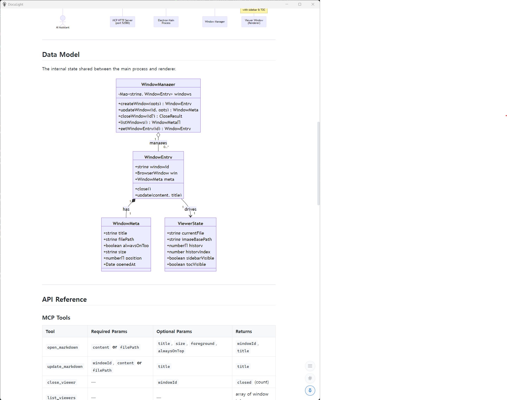

<div align="center">


# DocuLight

**Lightweight Markdown Viewer for Developers & AI Agents**

[](https://github.com/ice3x2/DocuLightViewer/releases)
[](LICENSE)
[](#installation)
[](#mcp-integration)

A desktop Markdown viewer built on Electron.
Renders GitHub-flavored Markdown, Mermaid diagrams, and syntax-highlighted code blocks.
Supports MCP (Model Context Protocol) so AI coding agents can open and update documents remotely.

</div>

---

## The Core Use Case — AI Agents Reporting to You

When a background coding agent finishes its work, it shouldn't just print a wall of text to
a terminal you might not be watching.
With DocuLight running in the background, the agent calls `open_markdown` with
`foreground: true` and **the report window jumps to the front of your screen** the moment the
job is done — no polling, no missed notifications.

```
╔══════════════════════════════════════════════════════════╗
║  Background Agent (Claude Code / any MCP client)         ║
║                                                          ║
║  1. Runs tasks autonomously …                            ║
║  2. Builds a Markdown report                             ║
║  3. Calls open_markdown(content, foreground: true)  ───► ║ DocuLight window
║                                                          ║   pops to foreground
╚══════════════════════════════════════════════════════════╝   immediately ✔
```

```javascript
// Agent reports completion — user sees it instantly
await mcpClient.callTool('open_markdown', {
  content: `# ✅ Task Complete\n\n${summary}\n\n## Changed Files\n${fileList}`,
  title:   'Agent Report',
  foreground:  true,   // ← brings window to front
  alwaysOnTop: true,   // ← stays visible while you read
  size: 'l'
});
```

The window stays **always-on-top** so it remains visible while you switch to your editor,
and a sidebar navigation tree lets you jump around a long report instantly.

---

## Screenshot



*DocuLight rendering a class diagram, sequence diagram, and API reference table — with sidebar
and Table of Contents visible.*

---

## Features

### Markdown Rendering
- **GitHub-Flavored Markdown (GFM)** — tables, task lists, strikethrough, autolinks
- **Mermaid Diagrams** — flowcharts, sequence, class, ER, Gantt, pie, xychart, and more
- **Syntax Highlighting** — 190+ languages via [highlight.js](#supported-languages)
- **Inline Images** — local files rendered via secure data-URI IPC (works in Electron sandbox)

### Navigation & UI
- **Sidebar link tree** — auto-generated from Markdown links (`[text](url)` and `[[wikilinks]]`)
- **Table of Contents** — auto-generated from headings, always visible on the right
- **Tabs** — open multiple documents in one window (`Ctrl+T`)
- **Navigation history** — back / forward buttons and keyboard shortcuts
- **Find in page** — `Ctrl+F`
- **Sidebar file search** — fuzzy-filter sidebar links (`Ctrl+Shift+F`)
- **Zoom** — `Ctrl+=` / `Ctrl+-` / `Ctrl+0`

### Window Management
- **Multiple viewer windows** — cascaded positions, each fully independent
- **Window size presets** — `s` / `m` / `l` / `f` (full-screen)
- **Always-on-top pin** — keep a report visible while coding
- **Foreground mode** — `open_markdown` can steal focus to alert you immediately
- **System tray** — app stays alive when all windows are closed; agents can open new ones at any time
- **Named windows** — `windowName` key for upsert (reuses an existing window instead of opening a new one)
- **Window tags** — `tags` array for grouping; close or list windows by tag
- **Severity color bar** — 4 px accent bar at the window top (`info` / `success` / `warning` / `error`)
- **Auto-close timer** — `autoCloseSeconds` closes the window after N seconds with a countdown UI
- **Taskbar progress bar** — `progress` (0.0 – 1.0) shows task completion on the OS taskbar; `-1` hides it
- **Taskbar flash** — `flash: true` blinks the taskbar button to request user attention

### Developer Workflow
- **MCP server (HTTP)** — embedded in the Electron process, reachable at `http://localhost:52580/mcp`
- **MCP server (stdio)** — standalone `mcp-server.mjs` for Claude Desktop and other stdio clients
- **Port discovery file** — actual bound port written to `{userData}/mcp-port` at startup
- **Auto-refresh** — watches the file on disk; reloads automatically on save
- **PDF export** — render the current document as a PDF
- **File association** — register `.md` files to open with DocuLight (packaged builds)
- **Settings UI** — theme, font size, font family, code theme, MCP port, auto-refresh, tabs
- **MCP auto-save** — MCP-opened files are auto-saved to a configurable path in date-based subdirectories

### Internationalization
- Supported languages: **English**, **Korean**, **Japanese**, **Spanish**
- Locale override via CLI arg (`npm run dev -- locale ja`) or `DOCULIGHT_LOCALE` env var
- Falls back to English when a translation is missing

### Themes & Appearance
| Option | Choices |
|--------|---------|
| UI Theme | `light`, `dark` |
| Code Highlight | `github` (auto dark variant in dark mode), `monokai`, `dracula` |
| Font Size | 8–32 px (default 16) |
| Font Family | Any CSS font stack |
| Content Width | Any CSS width value (default `900px`) |

### Settings

All settings are persisted via [electron-store](https://github.com/sindresorhus/electron-store).

| Setting | Default | Description |
|---------|---------|-------------|
| `theme` | `light` | UI color theme (`light` / `dark`) |
| `fontSize` | `16` | Base font size in pixels (8–32) |
| `fontFamily` | `system-ui, …` | CSS font stack |
| `codeTheme` | `github` | Syntax highlight theme |
| `contentWidth` | `900px` | Content area width |
| `contentMaxWidth` | `900px` | Content area max width |
| `mcpPort` | `52580` | HTTP MCP server port (1024–65535) |
| `defaultWindowSize` | `auto` | Default window size (`auto`/`s`/`m`/`l`/`f`) |
| `autoRefresh` | `true` | Auto-refresh on file change |
| `enableTabs` | `false` | Tab-based multi-document view |
| `mcpAutoSave` | `false` | Auto-save MCP-opened documents to disk |
| `mcpAutoSavePath` | `""` | Directory for MCP auto-saved files |

---

## MCP Integration

DocuLight exposes **six MCP tools** over both HTTP and stdio transports.
The HTTP server implements the [MCP Streamable HTTP](https://modelcontextprotocol.io/specification/2025-03-26/basic/transports#streamable-http) transport (JSON + SSE responses, session ID, `202` for notifications).

### Tools at a Glance

| Tool | Role | When to Use |
|------|------|-------------|
| `open_markdown` | **Display** — Open or upsert a viewer window | Show reports, logs, documentation, or any Markdown content to the user |
| `update_markdown` | **Update** — Modify an existing window | Append progress, change status/severity, update content in-place |
| `close_viewer` | **Cleanup** — Close windows | Clean up after task completion; close by ID, tag, or all at once |
| `list_viewers` | **Query** — List open windows | Check which reports are open before creating duplicates |
| `search_documents` | **Search** — Full-text search saved docs | Find previously saved documents by keyword (requires MCP auto-save) |
| `search_projects` | **Browse** — List/search projects | Discover available projects from saved document metadata |

### Severity Reference

The `severity` parameter controls a colored bar at the top of the window:

| Value | Color | Use For | Examples |
|-------|-------|---------|----------|
| `info` | Blue | General information, in-progress work | Progress reports, neutral notes, status updates |
| `success` | Green | Completed work, positive outcomes | Final reports, passed tests, finished tasks |
| `warning` | Yellow | Needs attention, potential issues | Review requests, deprecation notices, partial failures |
| `error` | Red | Failures, critical problems | Build failures, crash logs, blocked tasks |

### Document Type Reference

The `docType` parameter categorizes documents for search and organization:

| Value | Icon | Use For |
|-------|------|---------|
| `note` | 📝 | General notes (default) |
| `plan` | 📋 | Implementation plans, design documents |
| `report` | 📊 | Analysis results, status reports |
| `completion` | ✅ | Finished work, final deliverables |
| `issue` | 🐛 | Bug reports, problem descriptions |
| `review` | 🔍 | Code reviews, document reviews |
| `log` | 📜 | Progress logs, changelogs |
| `reference` | 📖 | API docs, configuration references |
| `guide` | 📘 | Tutorials, how-to guides |
| `spec` | 📐 | Specifications, SRS documents |

### User Prompt Examples

These are natural-language prompts you can give to an AI agent (Claude Code, Claude Desktop, etc.) that has DocuLight configured as an MCP server:

**Displaying content:**
```
"Show this analysis result in DocuLight"
"Open the README.md in a viewer window"
"Display the test results as a large window"
```

**Reporting task status:**
```
"Report the build result to DocuLight with a success indicator"
"Show the error log in DocuLight with error severity"
"Open a progress window and update it as you work"
```

**Managing windows:**
```
"Close all DocuLight windows"
"Close the windows tagged 'debug'"
"List all open viewer windows"
```

**Searching saved documents:**
```
"Search DocuLight for documents about authentication"
"Find all saved reports from the DocuLight project"
"List all projects in DocuLight"
```

**Advanced usage:**
```
"Open a named window 'build-status' so it updates in place instead of creating new windows"
"Show the report and auto-close it after 30 seconds"
"Flash the taskbar to get my attention when the report is ready"
```

### `open_markdown` parameters

| Parameter | Type | Default | Description |
|-----------|------|---------|-------------|
| `content` | string | — | Raw Markdown string to display |
| `filePath` | string | — | Absolute path to a `.md` file |
| `title` | string | filename | Window title bar text |
| `size` | `s`/`m`/`l`/`f` | `m` | Window size preset |
| `foreground` | boolean | `true` | Bring window to front immediately |
| `alwaysOnTop` | boolean | `true` | Keep window above all other windows *(HTTP MCP only)* |
| `windowName` | string | — | Named key for upsert — reuses existing window if name matches |
| `severity` | `info`/`success`/`warning`/`error` | — | Color bar at window top (see [Severity Reference](#severity-reference)) |
| `tags` | string[] | — | Tags for grouping / filtering windows |
| `flash` | boolean | `false` | Flash taskbar button to request user attention |
| `progress` | number (-1 – 1.0) | — | Taskbar progress bar value (`-1` = hide) |
| `autoCloseSeconds` | integer (1 – 3600) | — | Auto-close window after N seconds |
| `project` | string | — | Project name for frontmatter metadata |
| `docName` | string | — | Document name/identifier for frontmatter metadata |
| `description` | string | — | One-line summary for frontmatter metadata |
| `docType` | string | `note` | Document type for categorization (see [Document Type Reference](#document-type-reference)) |
| `noSave` | boolean | `false` | Skip auto-save for this call even if MCP auto-save is enabled |

### `update_markdown` parameters

| Parameter | Type | Default | Description |
|-----------|------|---------|-------------|
| `windowId` | string | **required** | Target window ID |
| `content` | string | — | New Markdown content |
| `filePath` | string | — | New file path to display |
| `title` | string | — | New window title |
| `appendMode` | boolean | `false` | Append to existing content instead of replacing |
| `separator` | string | `\n\n` | Separator used between existing and new content in append mode |
| `severity` | string | — | Update color bar theme (empty string to clear) |
| `tags` | string[] | — | Replace window tags |
| `flash` | boolean | `false` | Flash taskbar button |
| `progress` | number (-1 – 1.0) | — | Update taskbar progress bar |
| `autoCloseSeconds` | integer (1 – 3600) | — | Reset or set auto-close timer |
| `project` | string | — | Project name for frontmatter metadata |
| `docName` | string | — | Document name/identifier for frontmatter metadata |
| `description` | string | — | One-line summary for frontmatter metadata |
| `docType` | string | — | Document type for categorization |
| `noSave` | boolean | `false` | Skip auto-save for this call even if MCP auto-save is enabled |

### `close_viewer` parameters

| Parameter | Type | Description |
|-----------|------|-------------|
| `windowId` | string *(optional)* | Close a specific window by ID |
| `tag` | string *(optional)* | Close all windows that have this tag |

If neither `windowId` nor `tag` is provided, all open viewer windows are closed.

### `list_viewers` parameters

| Parameter | Type | Description |
|-----------|------|-------------|
| `tag` | string *(optional)* | Filter results — return only windows with this tag |

### `search_documents` parameters

| Parameter | Type | Default | Description |
|-----------|------|---------|-------------|
| `query` | string | **required** | Search query (Korean and English supported) |
| `limit` | integer (1 – 100) | `20` | Maximum number of results |
| `project` | string | — | Filter results by project name |
| `docType` | string | — | Filter results by document type |

### `search_projects` parameters

| Parameter | Type | Default | Description |
|-----------|------|---------|-------------|
| `query` | string | — | Search query for project name/description (omit for full list) |
| `limit` | integer (1 – 100) | `20` | Maximum number of results |

### Code examples

```javascript
// Open a named window and show a progress bar — no duplicate windows on repeated calls
await mcpClient.callTool('open_markdown', {
  windowName: 'build-status',
  title: 'Build in Progress',
  content: '# Building…\nStarting compilation.',
  severity: 'info',
  progress: 0.0,
  project: 'MyApp',
  docName: 'Build Status',
  docType: 'log',
});

// Update the same named window with append mode as the build progresses
await mcpClient.callTool('update_markdown', {
  windowId: buildWindowId,
  appendMode: true,
  content: 'Compilation done. Running tests…',
  progress: 0.5,
});

// On completion: update severity, remove progress bar, auto-close after 30 s
await mcpClient.callTool('update_markdown', {
  windowId: buildWindowId,
  severity: 'success',
  title: 'Build Passed',
  content: '# Build Passed\n\nAll 42 tests passed.',
  progress: -1,
  flash: true,
  autoCloseSeconds: 30,
  docType: 'completion',
});

// Show a final report with metadata
await mcpClient.callTool('open_markdown', {
  content: '# Code Review Report\n\n## Summary\n...',
  title: 'Code Review',
  severity: 'success',
  size: 'l',
  project: 'MyApp',
  docName: 'Sprint 5 Review',
  description: 'Code review results for sprint 5 feature branch',
  docType: 'review',
});

// Search previously saved documents
await mcpClient.callTool('search_documents', {
  query: 'authentication bug fix',
  project: 'MyApp',
  limit: 10,
});
```

### Configure with Claude Code

```bash
# Register the HTTP MCP server (one-time setup)
claude mcp add --transport http doclight http://localhost:52580/mcp
```

### Configure with Claude Desktop

Add to `~/Library/Application Support/Claude/claude_desktop_config.json` (macOS) or
`%APPDATA%\Claude\claude_desktop_config.json` (Windows):

**Running from source:**
```json
{
  "mcpServers": {
    "doculight": {
      "command": "node",
      "args": ["C:/path/to/DocuLightViewer/src/main/mcp-server.mjs"]
    }
  }
}
```

**Packaged (installed) app:**
```json
{
  "mcpServers": {
    "doculight": {
      "command": "node",
      "args": ["<path-to-mcp-server>"]
    }
  }
}
```

| Platform | `<path-to-mcp-server>` |
|----------|------------------------|
| Windows | `C:/Users/<USER>/AppData/Local/Programs/doculight/resources/app.asar.unpacked/src/main/mcp-server.bundle.mjs` |
| macOS | `/Applications/DocuLight.app/Contents/Resources/app.asar.unpacked/src/main/mcp-server.bundle.mjs` |
| Linux (deb) | `/opt/DocuLight/resources/app.asar.unpacked/src/main/mcp-server.bundle.mjs` |

> **AppImage users**: The MCP stdio path changes on each launch. Use HTTP transport instead:
> `claude mcp add --transport http doclight http://localhost:52580/mcp`

### Quick test via curl

```bash
curl -X POST http://localhost:52580/mcp \
  -H "Content-Type: application/json" \
  -d '{
    "jsonrpc": "2.0", "id": 1,
    "method": "tools/call",
    "params": {
      "name": "open_markdown",
      "arguments": {
        "content": "# Hello from the terminal!\n\nThis window was opened by **curl**.",
        "title": "curl demo",
        "foreground": true
      }
    }
  }'
```

---

## Installation

Download the latest installer from the
[**Releases**](https://github.com/ice3x2/DocuLightViewer/releases) page.

| Platform | File |
|----------|------|
| Windows (Installer) | `DocuLight-Setup-x.x.x.exe` |
| Windows (Portable) | `DocuLight-Portable-x.x.x.exe` |
| macOS (Apple Silicon) | `DocuLight-x.x.x-arm64.dmg` or `.zip` |
| macOS (Intel) | `DocuLight-x.x.x-x64.dmg` or `.zip` |
| Linux (AppImage) | `DocuLight-x.x.x.AppImage` |
| Linux (Debian/Ubuntu) | `DocuLight-x.x.x.deb` |

### macOS — Quick Install via curl (Recommended)

Unsigned DMG files are blocked by macOS Gatekeeper, requiring multiple security bypass steps.
The **ZIP + curl** method avoids this entirely:

```bash
curl -fsSL https://raw.githubusercontent.com/ice3x2/DocuLightViewer/main/install-mac.sh | bash
```

This script:
- Detects your architecture (Apple Silicon / Intel) automatically
- Downloads the latest ZIP release from GitHub
- Installs to `/Applications/DocuLight.app`
- Strips quarantine attributes so Gatekeeper does not block the app
- Supports upgrades — re-run the same command to update

To uninstall, simply delete `/Applications/DocuLight.app`.

### Run from source

```bash
git clone https://github.com/ice3x2/DocuLightViewer.git
cd DocuLightViewer
npm install
npm start          # launch app
npm run dev        # launch with --dev flag
```

**Requirements**: Node.js ≥ 20, npm

---

## Keyboard Shortcuts

| Shortcut | Action |
|----------|--------|
| `Ctrl+T` | Open new tab via file dialog |
| `Ctrl+W` | Close current tab / window |
| `Ctrl+B` | Toggle sidebar |
| `Ctrl+Shift+F` | Toggle sidebar file search |
| `Ctrl+F` | Find in page |
| `Ctrl+=` / `Ctrl+-` / `Ctrl+0` | Zoom in / out / reset |
| `Alt+←` / `Alt+→` | Navigate back / forward |
| `Escape` | Close PDF modal → exit sidebar search → release always-on-top |

---

## Supported Languages

Syntax highlighting is powered by [highlight.js](https://highlightjs.org/) and covers
**190+ languages**, including:

`bash` `c` `c++` `c#` `clojure` `coffeescript` `css` `dart` `diff` `dockerfile`
`elixir` `elm` `erlang` `fortran` `go` `graphql` `groovy` `haskell` `html` `http`
`java` `javascript` `json` `json5` `julia` `kotlin` `latex` `less` `lisp` `lua`
`makefile` `markdown` `matlab` `nginx` `nix` `objective-c` `ocaml` `perl` `php`
`plaintext` `powershell` `protobuf` `python` `r` `ruby` `rust` `scala` `scss`
`shell` `sql` `swift` `toml` `typescript` `vb` `vbscript` `vim` `wasm` `xml`
`yaml` `zig` … and [many more](https://highlightjs.org/demo).

### Mermaid Diagram Types

`flowchart` `sequenceDiagram` `classDiagram` `erDiagram` `gantt` `pie`
`stateDiagram-v2` `journey` `gitGraph` `mindmap` `timeline` `xychart-beta`
`quadrantChart` `sankey-beta` `block-beta`

---

## Architecture

```
DocuLight
├── src/main/
│   ├── index.js              Electron main process, IPC hub, app lifecycle
│   ├── window-manager.js     BrowserWindow lifecycle, cascade positions, history
│   ├── link-parser.js        Directory scanner → sidebar file tree (.md files)
│   ├── preload.js            contextBridge API (window.doclight)
│   ├── strings.js            i18n loader (ko, en, ja, es)
│   ├── frontmatter.js        YAML frontmatter injection/parsing utility
│   ├── search-engine.js      BM25 full-text search engine
│   ├── tokenizer.js          Korean + English composite tokenizer
│   ├── file-association.js   .md file association (Windows, packaged only)
│   ├── mcp-server.mjs        MCP stdio server (for Claude Desktop)
│   └── mcp-http.mjs          MCP Streamable HTTP server embedded in Electron
└── src/renderer/
    ├── viewer.html/js/css     Markdown viewer page
    ├── settings.html/js/css   Settings UI
    ├── tab-manager.js         Tab-based multi-document view
    ├── sidebar-search.js      Sidebar fuzzy search/filter
    ├── pdf-export-ui.js       PDF export modal
    └── image-resolver.js      Relative image path → file:// URL
```

---

## License

ISC © [ice3x2](https://github.com/ice3x2)

---

<div align="center">

Made with [Electron](https://www.electronjs.org/) ·
[Marked](https://marked.js.org/) ·
[Mermaid](https://mermaid.js.org/) ·
[highlight.js](https://highlightjs.org/) ·
[DOMPurify](https://github.com/cure53/DOMPurify)

</div>

---

<div align="center">

# DocuLight (한국어)

**개발자와 AI 에이전트를 위한 경량 Markdown 뷰어**

Electron 기반 데스크탑 Markdown 뷰어입니다.
GitHub-flavored Markdown, Mermaid 다이어그램, 구문 강조 코드 블록을 렌더링합니다.
MCP(Model Context Protocol)를 지원하여 AI 코딩 에이전트가 문서를 원격으로 열고 업데이트할 수 있습니다.

</div>

---

## 핵심 사용 시나리오 — AI 에이전트가 당신에게 보고합니다

백그라운드에서 실행 중인 코딩 에이전트가 작업을 마쳤을 때,
아무도 보지 않는 터미널에 긴 텍스트를 출력하는 것으로 끝나서는 안 됩니다.
DocuLight가 백그라운드에서 실행 중이라면, 에이전트가 `foreground: true`와 함께
`open_markdown`을 호출하는 순간 **보고서 창이 화면 맨 앞으로 튀어나옵니다** —
폴링도, 놓친 알림도 없습니다.

```
╔══════════════════════════════════════════════════════════╗
║  백그라운드 에이전트 (Claude Code / 모든 MCP 클라이언트)    ║
║                                                          ║
║  1. 자율적으로 작업 수행 …                                 ║
║  2. Markdown 보고서 작성                                   ║
║  3. open_markdown(content, foreground: true) 호출   ───► ║ DocuLight 창이
║                                                          ║   즉시 포그라운드로 ✔
╚══════════════════════════════════════════════════════════╝
```

```javascript
// 에이전트가 완료를 보고 — 사용자가 즉시 확인
await mcpClient.callTool('open_markdown', {
  content: `# ✅ 작업 완료\n\n${summary}\n\n## 변경된 파일\n${fileList}`,
  title:   '에이전트 보고서',
  foreground:  true,   // ← 창을 맨 앞으로
  alwaysOnTop: true,   // ← 읽는 동안 항상 위에 유지
  size: 'l'
});
```

창은 **항상 위** 상태를 유지하므로 에디터로 전환해도 보고서가 보이며,
사이드바 내비게이션 트리로 긴 보고서를 즉시 탐색할 수 있습니다.

---

## 기능

### Markdown 렌더링
- **GitHub-Flavored Markdown (GFM)** — 테이블, 할 일 목록, 취소선, 자동 링크
- **Mermaid 다이어그램** — 플로우차트, 시퀀스, 클래스, ER, Gantt, 파이, xychart 등
- **구문 강조** — [highlight.js](#지원-언어)를 통한 190개 이상의 언어
- **인라인 이미지** — 보안 data-URI IPC를 통한 로컬 파일 렌더링 (Electron 샌드박스 지원)

### 내비게이션 & UI
- **사이드바 링크 트리** — Markdown 링크(`[텍스트](url)` 및 `[[위키링크]]`)에서 자동 생성
- **목차(TOC)** — 제목에서 자동 생성, 오른쪽에 항상 표시
- **탭** — 하나의 창에서 여러 문서 열기 (`Ctrl+T`)
- **내비게이션 히스토리** — 뒤로/앞으로 버튼 및 단축키
- **페이지 내 검색** — `Ctrl+F`
- **사이드바 파일 검색** — 사이드바 링크 퍼지 필터 (`Ctrl+Shift+F`)
- **확대/축소** — `Ctrl+=` / `Ctrl+-` / `Ctrl+0`

### 창 관리
- **다중 뷰어 창** — 계단식 위치, 각각 완전히 독립
- **창 크기 프리셋** — `s` / `m` / `l` / `f` (전체 화면)
- **항상 위 고정** — 코딩하는 동안 보고서를 항상 보이게 유지
- **포그라운드 모드** — `open_markdown`이 즉시 포커스를 가져와 알림
- **시스템 트레이** — 모든 창이 닫혀도 앱이 살아있어 에이전트가 언제든 새 창을 열 수 있음
- **이름 있는 창(Named Window)** — `windowName` 키로 upsert (기존 창 재사용, 중복 창 방지)
- **창 태그** — `tags` 배열로 그룹화; 태그 기반 일괄 close/list 지원
- **Severity 색상 바** — 창 상단 4px 색상 바 (`info` / `success` / `warning` / `error`)
- **자동 닫힘 타이머** — `autoCloseSeconds`로 N초 후 자동 닫힘, 카운트다운 UI 표시
- **태스크바 진행률 표시** — `progress` (0.0 – 1.0)로 OS 태스크바에 작업 진행률 표시; `-1`로 숨김
- **태스크바 플래시** — `flash: true`로 태스크바 버튼 깜빡임, 사용자 주의 요청

### 개발자 워크플로
- **MCP 서버 (HTTP)** — Electron 프로세스에 내장, `http://localhost:52580/mcp`로 접근
- **MCP 서버 (stdio)** — Claude Desktop 등 stdio 클라이언트를 위한 독립 `mcp-server.mjs`
- **포트 디스커버리 파일** — 시작 시 실제 바인딩된 포트를 `{userData}/mcp-port`에 기록
- **자동 새로고침** — 디스크의 파일을 감시하여 저장 시 자동 재로드
- **PDF 내보내기** — 현재 문서를 PDF로 렌더링
- **파일 연결** — `.md` 파일을 DocuLight로 열도록 등록 (패키징 빌드)
- **설정 UI** — 테마, 폰트 크기, 폰트 패밀리, 코드 테마, MCP 포트, 자동 새로고침, 탭
- **MCP 자동 저장** — MCP로 열린 파일을 설정 경로에 날짜 기반 폴더 구조로 자동 저장

### 다국어 지원
- 지원 언어: **한국어**, **영어**, **일본어**, **스페인어**
- CLI 인자(`npm run dev -- locale ja`) 또는 `DOCULIGHT_LOCALE` 환경 변수로 로케일 변경
- 번역이 없으면 영어로 폴백

### 테마 & 외관
| 옵션 | 선택지 |
|------|--------|
| UI 테마 | `light`, `dark` |
| 코드 강조 | `github` (다크 모드 시 자동 다크 변형), `monokai`, `dracula` |
| 폰트 크기 | 8–32 px (기본값 16) |
| 폰트 패밀리 | 임의의 CSS 폰트 스택 |
| 콘텐츠 너비 | 임의의 CSS 너비 값 (기본값 `900px`) |

### 설정

모든 설정은 [electron-store](https://github.com/sindresorhus/electron-store)를 통해 저장됩니다.

| 설정 | 기본값 | 설명 |
|------|--------|------|
| `theme` | `light` | UI 색상 테마 (`light` / `dark`) |
| `fontSize` | `16` | 기본 폰트 크기 (8–32 px) |
| `fontFamily` | `system-ui, …` | CSS 폰트 스택 |
| `codeTheme` | `github` | 구문 강조 테마 |
| `contentWidth` | `900px` | 콘텐츠 영역 너비 |
| `contentMaxWidth` | `900px` | 콘텐츠 영역 최대 너비 |
| `mcpPort` | `52580` | HTTP MCP 서버 포트 (1024–65535) |
| `defaultWindowSize` | `auto` | 기본 창 크기 (`auto`/`s`/`m`/`l`/`f`) |
| `autoRefresh` | `true` | 파일 변경 시 자동 새로고침 |
| `enableTabs` | `false` | 탭 기반 다중 문서 뷰 |
| `mcpAutoSave` | `false` | MCP로 열린 문서 자동 저장 |
| `mcpAutoSavePath` | `""` | MCP 자동 저장 경로 |

---

## MCP 연동

DocuLight는 HTTP와 stdio 두 가지 전송 방식으로 **6개의 MCP 도구**를 제공합니다.
HTTP 서버는 [MCP Streamable HTTP](https://modelcontextprotocol.io/specification/2025-03-26/basic/transports#streamable-http) 전송 프로토콜을 구현합니다 (JSON + SSE 응답, 세션 ID, notification에 `202` 반환).

### 도구 한눈에 보기

| 도구 | 역할 | 사용 시점 |
|------|------|-----------|
| `open_markdown` | **표시** — 뷰어 창 열기 또는 upsert | 보고서, 로그, 문서 등 Markdown 콘텐츠를 사용자에게 보여줄 때 |
| `update_markdown` | **업데이트** — 기존 창 수정 | 진행 상황 추가, 상태/severity 변경, 내용 현재 위치에서 갱신 |
| `close_viewer` | **정리** — 창 닫기 | 작업 완료 후 정리; ID, 태그, 또는 전체 일괄 닫기 |
| `list_viewers` | **조회** — 열린 창 목록 | 중복 생성 전 어떤 보고서가 열려 있는지 확인 |
| `search_documents` | **검색** — 저장된 문서 전문 검색 | 키워드로 이전에 저장된 문서 찾기 (MCP 자동 저장 필요) |
| `search_projects` | **탐색** — 프로젝트 목록/검색 | 저장된 문서 메타데이터에서 프로젝트 탐색 |

### Severity 참조

`severity` 파라미터는 창 상단에 색상 바를 표시합니다:

| 값 | 색상 | 용도 | 예시 |
|----|------|------|------|
| `info` | 파란색 | 일반 정보, 진행 중인 작업 | 진행 보고서, 중립적 메모, 상태 업데이트 |
| `success` | 초록색 | 완료된 작업, 긍정적 결과 | 최종 보고서, 통과한 테스트, 완료된 태스크 |
| `warning` | 노란색 | 주의 필요, 잠재적 문제 | 리뷰 요청, 폐기 예정 알림, 부분 실패 |
| `error` | 빨간색 | 실패, 심각한 문제 | 빌드 실패, 크래시 로그, 차단된 작업 |

### 문서 타입 참조

`docType` 파라미터는 문서를 분류하여 검색과 정리에 활용합니다:

| 값 | 아이콘 | 용도 |
|----|--------|------|
| `note` | 📝 | 일반 메모 (기본값) |
| `plan` | 📋 | 구현 계획, 설계 문서 |
| `report` | 📊 | 분석 결과, 상태 보고서 |
| `completion` | ✅ | 완료된 작업, 최종 산출물 |
| `issue` | 🐛 | 버그 보고서, 문제 설명 |
| `review` | 🔍 | 코드 리뷰, 문서 리뷰 |
| `log` | 📜 | 진행 로그, 변경 이력 |
| `reference` | 📖 | API 문서, 설정 참조 |
| `guide` | 📘 | 튜토리얼, 사용법 가이드 |
| `spec` | 📐 | 사양서, SRS 문서 |

### 사용자 프롬프트 예시

DocuLight를 MCP 서버로 설정한 AI 에이전트(Claude Code, Claude Desktop 등)에게 자연어로 요청할 수 있는 예시입니다:

**콘텐츠 표시:**
```
"이 분석 결과를 DocuLight로 보여줘"
"README.md를 뷰어 창에 열어줘"
"테스트 결과를 큰 창으로 표시해줘"
```

**작업 상태 보고:**
```
"빌드 결과를 성공 표시와 함께 DocuLight로 보고해줘"
"에러 로그를 DocuLight에 error severity로 보여줘"
"진행 상황 창을 열고 작업하면서 업데이트해줘"
```

**창 관리:**
```
"DocuLight 창 모두 닫아줘"
"debug 태그가 붙은 창들 닫아줘"
"열려 있는 뷰어 창 목록 보여줘"
```

**저장된 문서 검색:**
```
"DocuLight에서 인증 관련 문서 검색해줘"
"DocuLight 프로젝트의 저장된 보고서 전부 찾아줘"
"DocuLight에 등록된 프로젝트 목록 보여줘"
```

**고급 사용법:**
```
"build-status라는 이름으로 창을 열어서 새 창을 만들지 말고 같은 창에 업데이트해줘"
"보고서를 보여주고 30초 후에 자동으로 닫아줘"
"보고서가 준비되면 태스크바를 깜빡여서 알려줘"
```

### `open_markdown` 파라미터

| 파라미터 | 타입 | 기본값 | 설명 |
|---------|------|--------|------|
| `content` | string | — | 표시할 원시 Markdown 문자열 |
| `filePath` | string | — | `.md` 파일의 절대 경로 |
| `title` | string | 파일명 | 창 제목 표시줄 텍스트 |
| `size` | `s`/`m`/`l`/`f` | `m` | 창 크기 프리셋 |
| `foreground` | boolean | `true` | 즉시 창을 맨 앞으로 가져오기 |
| `alwaysOnTop` | boolean | `true` | 다른 모든 창 위에 유지 *(HTTP MCP 전용)* |
| `windowName` | string | — | upsert용 이름 키 — 동일 이름의 창이 있으면 재사용 |
| `severity` | `info`/`success`/`warning`/`error` | — | 창 상단 색상 바 ([Severity 참조](#severity-참조) 참고) |
| `tags` | string[] | — | 창 그룹화 / 필터링용 태그 |
| `flash` | boolean | `false` | 태스크바 버튼 깜빡임으로 사용자 주의 요청 |
| `progress` | number (-1 – 1.0) | — | 태스크바 진행률 (`-1` = 숨김) |
| `autoCloseSeconds` | integer (1 – 3600) | — | N초 후 자동 닫힘 |
| `project` | string | — | frontmatter 메타데이터용 프로젝트 이름 |
| `docName` | string | — | frontmatter 메타데이터용 문서 이름/식별자 |
| `description` | string | — | frontmatter 메타데이터용 한 줄 요약 |
| `docType` | string | `note` | 문서 타입 분류 ([문서 타입 참조](#문서-타입-참조) 참고) |
| `noSave` | boolean | `false` | MCP 자동 저장이 켜져 있어도 이 호출에서는 파일 저장 생략 |

### `update_markdown` 파라미터

| 파라미터 | 타입 | 기본값 | 설명 |
|---------|------|--------|------|
| `windowId` | string | **필수** | 대상 창 ID |
| `content` | string | — | 새 Markdown 내용 |
| `filePath` | string | — | 새 파일 경로 |
| `title` | string | — | 새 창 제목 |
| `appendMode` | boolean | `false` | 기존 내용에 추가 (replace 대신 append) |
| `separator` | string | `\n\n` | append 모드에서 기존 내용과 새 내용 사이 구분자 |
| `severity` | string | — | 색상 바 테마 업데이트 (빈 문자열로 제거) |
| `tags` | string[] | — | 창 태그 교체 |
| `flash` | boolean | `false` | 태스크바 버튼 깜빡임 |
| `progress` | number (-1 – 1.0) | — | 태스크바 진행률 업데이트 |
| `autoCloseSeconds` | integer (1 – 3600) | — | 자동 닫힘 타이머 재설정 또는 설정 |
| `project` | string | — | frontmatter 메타데이터용 프로젝트 이름 |
| `docName` | string | — | frontmatter 메타데이터용 문서 이름/식별자 |
| `description` | string | — | frontmatter 메타데이터용 한 줄 요약 |
| `docType` | string | — | 문서 타입 분류 |
| `noSave` | boolean | `false` | MCP 자동 저장이 켜져 있어도 이 호출에서는 파일 저장 생략 |

### `close_viewer` 파라미터

| 파라미터 | 타입 | 설명 |
|---------|------|------|
| `windowId` | string *(선택)* | 특정 창 ID로 닫기 |
| `tag` | string *(선택)* | 해당 태그를 가진 모든 창 닫기 |

`windowId`와 `tag` 모두 생략하면 열려 있는 모든 뷰어 창을 닫습니다.

### `list_viewers` 파라미터

| 파라미터 | 타입 | 설명 |
|---------|------|------|
| `tag` | string *(선택)* | 이 태그를 가진 창만 필터링하여 반환 |

### `search_documents` 파라미터

| 파라미터 | 타입 | 기본값 | 설명 |
|---------|------|--------|------|
| `query` | string | **필수** | 검색 쿼리 (한국어, 영어 지원) |
| `limit` | integer (1 – 100) | `20` | 최대 결과 수 |
| `project` | string | — | 프로젝트 이름으로 필터링 |
| `docType` | string | — | 문서 타입으로 필터링 |

### `search_projects` 파라미터

| 파라미터 | 타입 | 기본값 | 설명 |
|---------|------|--------|------|
| `query` | string | — | 프로젝트 이름/설명 검색 쿼리 (생략 시 전체 목록) |
| `limit` | integer (1 – 100) | `20` | 최대 결과 수 |

### 코드 예제

```javascript
// 이름 있는 창 열기 — 반복 호출해도 중복 창이 생기지 않음
await mcpClient.callTool('open_markdown', {
  windowName: 'build-status',
  title: '빌드 진행 중',
  content: '# 빌드 중…\n컴파일을 시작합니다.',
  severity: 'info',
  progress: 0.0,
  project: 'MyApp',
  docName: '빌드 상태',
  docType: 'log',
});

// 같은 창에 내용 추가(append) + 진행률 업데이트
await mcpClient.callTool('update_markdown', {
  windowId: buildWindowId,
  appendMode: true,
  content: '컴파일 완료. 테스트를 실행합니다…',
  progress: 0.5,
});

// 완료 시: severity 변경, 진행률 제거, 30초 후 자동 닫힘
await mcpClient.callTool('update_markdown', {
  windowId: buildWindowId,
  severity: 'success',
  title: '빌드 성공',
  content: '# 빌드 성공\n\n42개 테스트 모두 통과.',
  progress: -1,
  flash: true,
  autoCloseSeconds: 30,
  docType: 'completion',
});

// 메타데이터가 포함된 최종 보고서 표시
await mcpClient.callTool('open_markdown', {
  content: '# 코드 리뷰 보고서\n\n## 요약\n...',
  title: '코드 리뷰',
  severity: 'success',
  size: 'l',
  project: 'MyApp',
  docName: '스프린트 5 리뷰',
  description: '스프린트 5 기능 브랜치 코드 리뷰 결과',
  docType: 'review',
});

// 이전에 저장된 문서 검색
await mcpClient.callTool('search_documents', {
  query: '인증 버그 수정',
  project: 'MyApp',
  limit: 10,
});
```

### Claude Code에서 설정

```bash
# HTTP MCP 서버 등록 (최초 1회)
claude mcp add --transport http doclight http://localhost:52580/mcp
```

### Claude Desktop에서 설정

macOS: `~/Library/Application Support/Claude/claude_desktop_config.json`
Windows: `%APPDATA%\Claude\claude_desktop_config.json`

**소스에서 실행하는 경우:**
```json
{
  "mcpServers": {
    "doculight": {
      "command": "node",
      "args": ["C:/path/to/DocuLightViewer/src/main/mcp-server.mjs"]
    }
  }
}
```

**패키징(설치) 앱 사용 시:**
```json
{
  "mcpServers": {
    "doculight": {
      "command": "node",
      "args": ["<mcp-server-경로>"]
    }
  }
}
```

| 플랫폼 | `<mcp-server-경로>` |
|--------|----------------------|
| Windows | `C:/Users/<USER>/AppData/Local/Programs/doculight/resources/app.asar.unpacked/src/main/mcp-server.bundle.mjs` |
| macOS | `/Applications/DocuLight.app/Contents/Resources/app.asar.unpacked/src/main/mcp-server.bundle.mjs` |
| Linux (deb) | `/opt/DocuLight/resources/app.asar.unpacked/src/main/mcp-server.bundle.mjs` |

> **AppImage 사용자:** AppImage는 읽기 전용 파일시스템으로 stdio 전송이 작동하지 않습니다. 대신 HTTP 전송 (`http://localhost:52580/mcp`)을 사용하세요.

### curl로 빠른 테스트

```bash
curl -X POST http://localhost:52580/mcp \
  -H "Content-Type: application/json" \
  -d '{
    "jsonrpc": "2.0", "id": 1,
    "method": "tools/call",
    "params": {
      "name": "open_markdown",
      "arguments": {
        "content": "# 터미널에서 안녕하세요!\n\n이 창은 **curl**로 열었습니다.",
        "title": "curl 데모",
        "foreground": true
      }
    }
  }'
```

---

## 설치

[**Releases**](https://github.com/ice3x2/DocuLightViewer/releases) 페이지에서
최신 설치 파일을 내려받으세요.

| 플랫폼 | 파일 |
|--------|------|
| Windows (설치 파일) | `DocuLight-Setup-x.x.x.exe` |
| Windows (포터블) | `DocuLight-Portable-x.x.x.exe` |
| macOS (Apple Silicon) | `DocuLight-x.x.x-arm64.dmg` 또는 `.zip` |
| macOS (Intel) | `DocuLight-x.x.x-x64.dmg` 또는 `.zip` |
| Linux (AppImage) | `DocuLight-x.x.x.AppImage` |
| Linux (Debian/Ubuntu) | `DocuLight-x.x.x.deb` |

### macOS — curl로 간편 설치 (권장)

미서명 DMG 파일은 macOS Gatekeeper에 의해 차단되어 여러 단계의 보안 우회 조작이 필요합니다.
**ZIP + curl** 방식을 사용하면 이 과정을 완전히 건너뛸 수 있습니다:

```bash
curl -fsSL https://raw.githubusercontent.com/ice3x2/DocuLightViewer/main/install-mac.sh | bash
```

이 스크립트는:
- 아키텍처(Apple Silicon / Intel)를 자동 감지합니다
- GitHub에서 최신 ZIP 릴리스를 다운로드합니다
- `/Applications/DocuLight.app`에 설치합니다
- quarantine 속성을 제거하여 Gatekeeper 차단을 방지합니다
- 업그레이드를 지원합니다 — 같은 명령을 다시 실행하면 최신 버전으로 업데이트됩니다

삭제하려면 `/Applications/DocuLight.app`을 삭제하면 됩니다.

### 소스에서 실행

```bash
git clone https://github.com/ice3x2/DocuLightViewer.git
cd DocuLightViewer
npm install
npm start          # 앱 실행
npm run dev        # --dev 플래그로 실행
```

**요구 사항**: Node.js ≥ 20, npm

---

## 키보드 단축키

| 단축키 | 동작 |
|--------|------|
| `Ctrl+T` | 파일 대화상자로 새 탭 열기 |
| `Ctrl+W` | 현재 탭 / 창 닫기 |
| `Ctrl+B` | 사이드바 토글 |
| `Ctrl+Shift+F` | 사이드바 파일 검색 토글 |
| `Ctrl+F` | 페이지 내 검색 |
| `Ctrl+=` / `Ctrl+-` / `Ctrl+0` | 확대 / 축소 / 초기화 |
| `Alt+←` / `Alt+→` | 뒤로 / 앞으로 이동 |
| `Escape` | PDF 모달 닫기 → 사이드바 검색 종료 → 항상 위 해제 |

---

## 지원 언어

구문 강조는 [highlight.js](https://highlightjs.org/)로 구동되며
**190개 이상의 언어**를 지원합니다:

`bash` `c` `c++` `c#` `clojure` `coffeescript` `css` `dart` `diff` `dockerfile`
`elixir` `elm` `erlang` `fortran` `go` `graphql` `groovy` `haskell` `html` `http`
`java` `javascript` `json` `json5` `julia` `kotlin` `latex` `less` `lisp` `lua`
`makefile` `markdown` `matlab` `nginx` `nix` `objective-c` `ocaml` `perl` `php`
`plaintext` `powershell` `protobuf` `python` `r` `ruby` `rust` `scala` `scss`
`shell` `sql` `swift` `toml` `typescript` `vb` `vbscript` `vim` `wasm` `xml`
`yaml` `zig` … 그 외 [다수](https://highlightjs.org/demo).

### Mermaid 다이어그램 타입

`flowchart` `sequenceDiagram` `classDiagram` `erDiagram` `gantt` `pie`
`stateDiagram-v2` `journey` `gitGraph` `mindmap` `timeline` `xychart-beta`
`quadrantChart` `sankey-beta` `block-beta`

---

## 아키텍처

```
DocuLight
├── src/main/
│   ├── index.js              Electron 메인 프로세스, IPC 허브, 앱 라이프사이클
│   ├── window-manager.js     BrowserWindow 라이프사이클, 계단식 위치, 히스토리
│   ├── link-parser.js        디렉토리 스캐너 → 사이드바 파일 트리 (.md 파일)
│   ├── preload.js            contextBridge API (window.doclight)
│   ├── strings.js            i18n 로더 (ko, en, ja, es)
│   ├── frontmatter.js        YAML frontmatter 주입/파싱 유틸리티
│   ├── search-engine.js      BM25 전문 검색 엔진
│   ├── tokenizer.js          한국어 + 영어 복합 토크나이저
│   ├── file-association.js   .md 파일 연결 (Windows, 패키징 빌드 전용)
│   ├── mcp-server.mjs        MCP stdio 서버 (Claude Desktop용)
│   └── mcp-http.mjs          Electron에 내장된 MCP Streamable HTTP 서버
└── src/renderer/
    ├── viewer.html/js/css     Markdown 뷰어 페이지
    ├── settings.html/js/css   설정 UI
    ├── tab-manager.js         탭 기반 다중 문서 뷰
    ├── sidebar-search.js      사이드바 퍼지 검색/필터
    ├── pdf-export-ui.js       PDF 내보내기 모달
    └── image-resolver.js      상대 이미지 경로 → file:// URL
```

