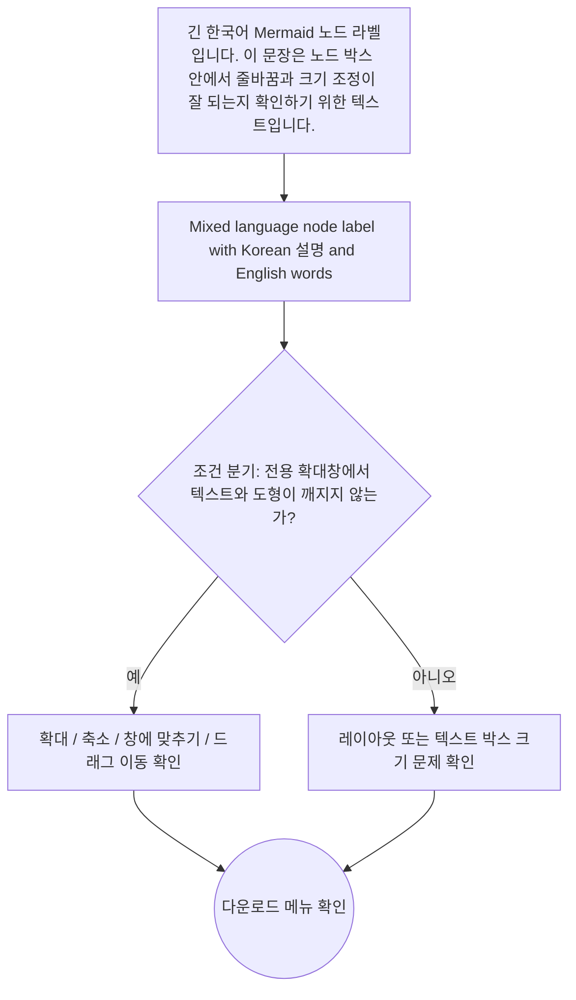
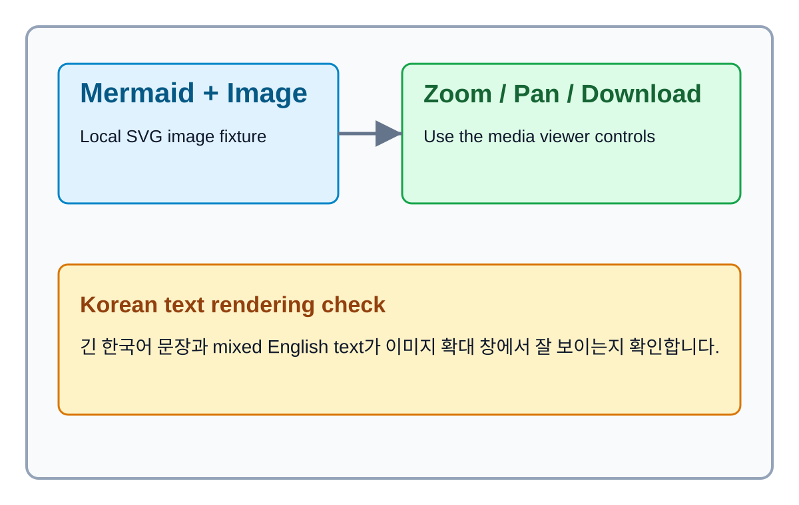

# Mermaid And Image Viewer Sample

이 문서는 DocuLight의 Mermaid 뷰어와 이미지 뷰어를 빠르게 확인하기 위한 샘플입니다.

## Mermaid



## Local Image



## Code Block

```javascript
const message = 'copy button hover sample';
console.log(message);
```
