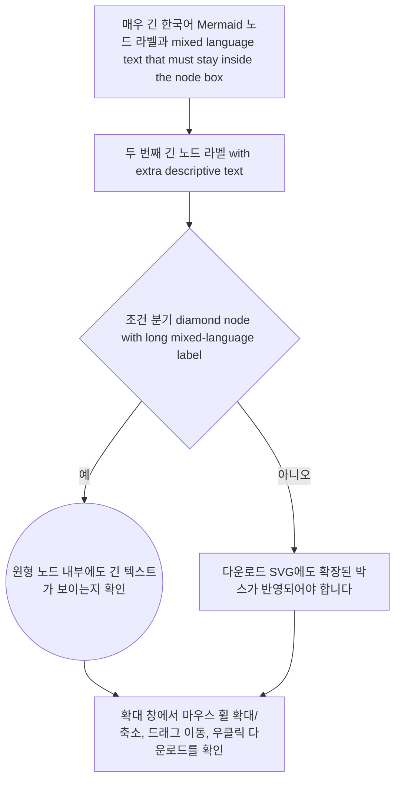

# Mermaid Media Viewer Manual Test

이 문서는 `FR-RENDER-028` 전용 Mermaid / 이미지 뷰어를 수동으로 확인하기 위한 샘플입니다.

확인 항목:

- 문서 안 Mermaid 블록 좌측 상단에 확장 버튼이 보이는지 확인합니다.
- 확장 버튼을 누르면 전용 미디어 뷰어 창이 열리는지 확인합니다.
- 긴 텍스트가 노드 박스 밖으로 나가지 않는지 확인합니다.
- 마우스 휠 확대/축소, 왼쪽 버튼 드래그 이동, 우클릭 다운로드를 확인합니다.
