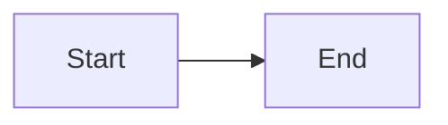

# Hello World

This is a test document for DocLight E2E testing.

## Features

- Markdown rendering
- [Link to Guide](./guide.md)
- [External link](https://example.com)

## Code Block

```javascript
function hello() {
  console.log('Hello from DocLight!');
}
```

## Mermaid Diagram



## XSS Test

<script>alert('xss')</script>


Normal text after XSS attempt.
